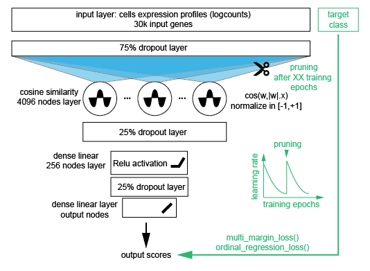

# scml

An R package 
In particular, contains an helper function to train and predict multi-class and ordinal regression models on single-cell data.


`scml` is a R package with a Deep Learning architecture efficient to train models 
on single-cell transcriptomic data. The models predictions can further be used 
to annotate new data. 

The models typically takes as 
input `logcounts` expression matrix and train a multi-class classifier able to 
assign a class (e.g. cell-type) to each cell. Efficiency of the model lies in 
its architecture and in its training process, see **Figure 1**.


|  |
|:--:|
| **Figure 1:** *Overview of model architecture and training procedure used in `scml`* |


The architecture is efficient on single-cell data because of these characteristics:

1- `scml` use cosine similarity in the first layer to normalize input data 
    combined with an attention mechanism.

2- The training procedure is done in two phases, with a weight pruning on the 
   first layer at end the first phase. The pruning keep for each cosine node 
   50 inputs with highest weights and 50 inputs with lowest weights.

3- In each phase, the learning rate parameter is decreased at each epoch 
   according to a geometric serie.

4- Depending on the prediction target, `scml` optimize `multi_margin_loss()` 
   (e.g. to predict cell-type) or `ordinal_regression_loss()` (e.g. to predict
   age of the organism the cell is coming from).


## Installation

You can install the development version of scml from [GitHub](https://github.com/) with:

``` r
# install.packages("devtools")
devtools::install_github("BioinfoSupport/scml")
```

## Usage

``` r
# Train a multi-class model
fm <- scml::train_delayed_classifier(
  cell_x_gene_matrix,                        # usually t(log2(RPM+1)): expression matrix with genes as column, so often transposed
  cells_class,                               # a factor containing the class of the cells
  accelerator = luz::accelerator(cpu=TRUE),  # train on cpu
  input_dropout_rate = 0.75,                 # Amount of dropout during training
  batch_size = 512L,
  valid_data = 0.1,                          # Percentage of data used for validation
  pre_pruning_epoch = 5,                     # Number of epoch before pruning the model
  post_pruning_epoch = 5                     # Number of epoch after pruning the model
)
luz::luz_save(fm,"my_model.luz")

# Predict new cells with the model
pred <- predict(luz::luz_load("my_model.luz"),cell_x_gene_matrix) |> as_array()
```


## Example with iris

`iris` is a common toy dataset not related to single-cell transcriptomic.
We use it here for demonstration purpose only. Also because `iris` is small
we remove the `input_dropout=0`. We also increase the initial learning rate to
`lr_start=0.1`.

``` r
# Learn the model
fm <- scml::train_delayed_classifier(
  data.matrix(iris[1:4]),    # Input matrix
  iris$Species,              # Target class to predict
  lr_start = 0.1,            # Increase initial learning rate
  pre_pruning_epoch = 50L,   # Number of epoch before model pruning
  post_pruning_epoch = 50L,  # Number of epoch after model pruning
  batch_size = 150L,         # Number of sample per batch (here all dataset)
  valid_data = 0.1,          # Keep 10% of samples for validation-set
  input_dropout_rate = 0,    # Disable input dropout
  accelerator = accelerator(cpu=TRUE) # Train on CPU
)

# Show learning curves
plot(fm)

# Predict each sample (training + validation set)
pred_scores <- predict_delayed(data.matrix(iris[1:4]),fm,accelerator = accelerator(cpu=TRUE))
pred_label <- colnames(pred_scores)[max.col(pred_scores)]

# Show contingency table
table(real_class=iris$Species,prediction=pred_label,useNA="i")
```


